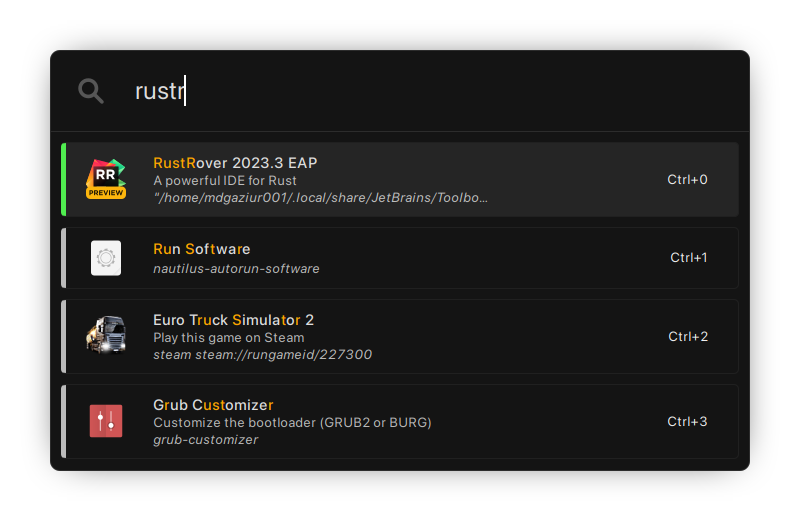

# Findex



<p align="center">Findex is a highly customizable application launcher written in Rust and uses GTK3</p>

## Table of Contents

<!-- TOC -->
* [Findex](#findex)
  * [Table of Contents](#table-of-contents)
  * [Quick Note](#quick-note)
  * [Features](#features)
  * [Installation](#installation)
    * [Supported OS](#supported-os)
    * [Requirements](#requirements)
    * [Automated installation from source](#automated-installation-from-source)
    * [Manual installation from source](#manual-installation-from-source)
    * [Installation from AUR](#installation-from-aur)
    * [Notes](#notes)
  * [Customization](#customization)
  * [Plugins](#plugins)
    * [For users](#for-users)
    * [For developers](#for-developers)
    * [Explanation](#explanation)
      * [Prefix](#prefix)
      * [Keyboard shortcut](#keyboard-shortcut)
      * [`init` function](#init-function)
      * [`handle_query` function](#handle_query-function)
  * [Reporting Bugs](#reporting-bugs)
<!-- TOC -->

## Quick Note

The tyranny of Israel on the Palestinian people is horrifying and heartbreaking. As such, we all
should try our best to support the Palestinians from our position. Consider supporting the Palestinians
by donating to the [Palestinian Red Crescent Society](https://www.palestinercs.org/en/Donation).

[](https://www.palestinercs.org/en/Donation)

Banner from: https://github.com/Safouene1/support-palestine-banner/


## Features

- Customization using CSS
- Plugin system
- Custom shortcut for triggering plugins
- Shortcut for executing each result(upto 10)

## Installation

If you are not using Findex directly from `development` branch and using latest release,
check instructions from the `release` branch.

### Supported OS
- Linux

### Requirements
- Gtk3
- libkeybinder3
- Rust v1.66.0 (building from source)

### Automated installation from source
- Run `./installer.sh`

### Manual installation from source
- Set Rust toolchain to stable using: `rustup default stable`
- Compile it using `cargo build --release`
- Make `/opt/findex` directory
- Copy `css/style.css` to `/opt/findex`
- Copy `target/release/findex` to `/usr/bin/`
- Copy `targer/release/findex-daemon` to `/usr/bin/`
- Add `findex-daemon` to autostart/startup applications

### Installation from AUR

From repo: `findex-git`   
Prebuilt: `findex-bin`

After that, add `findex-daemon` to autostart/startup applications

### Notes
- Findex can't bind hotkey in Wayland. Bind hotkey to `echo 1 > ~/.config/findex/toggle_file`
- Window decoration settings may not work in Wayland


## Customization

Findex can be customized by applying properties to certain css classes. Below is a table containing class names and what they correspond to:

| Class                          | Widget                                                            |
|--------------------------------|-------------------------------------------------------------------|
| findex-window                  | Top level window                                                  |
| findex-container               | Top level container of all widgets                                |
| findex-query                   | Text input box where user gives query                             |
| findex-results-scroll          | Scrollable container containing ListBox that shows search results |
| findex-results                 | Listbox containing search results                                 |
| findex-result-row              | ListBoxRow containing single search result                        |
| findex-result-icon             | App icon of result row                                            |
| findex-result-app-name         | App name of result row                                            |
| findex-result-app-description  | Description of the app                                            |
| findex-result-app-command      | Command of the app                                                |
| findex-result-trigger-shortcut | Shortcut for running the command in the result                    |
| findex-result-icon-container   | Container of the icon of each result                              |
| findex-result-info-container   | Container of the info of each result                              |
| findex-query-container         | Container of the search box                                       |

To customize Findex, edit the style.css file in `~/.config/findex`. If there is no such file, run Findex to generate it.

Behaviour can be changed by modifying `~/.config/findex/settings.toml`. If there is no such file, run Findex to generate it.

| Name                         | Description                                                                                                              | Type    |
|------------------------------|--------------------------------------------------------------------------------------------------------------------------|---------|
| default_window_width         | Set default width of the window                                                                                          | Integer |
| min_content_height           | Minimum content height of result                                                                                         | Integer |
| max_content_height           | Maximum content height of result                                                                                         | Integer |
| name_match_highlight_color   | Color of matches highlighted in app name                                                                                 | String  |
| min_score                    | Minimum Score of app name match                                                                                          | Integer |
| result_size                  | Maximum amount of apps to show as result                                                                                 | Integer |
| toggle_key                   | Key to toggle Findex(eg. `<Alt>space`). This doesn't work in Wayland. Check [Installation](#installation) for more info. | String  |
| decorate_window              | Show toolbar of window                                                                                                   | Boolean |
| query_placeholder            | Placeholder text to show in query input box                                                                              | String  |
| close_window_on_losing_focus | Close window when it loses focus                                                                                         | Boolean |
| icon_size                    | Icon width and height will be set from this value                                                                        | Integer |
| entry_icon                   | Icon displayed beside the searchbar                                                                                      | String  |


## Plugins

### For users
- Download the plugin. If it's not compiled, then compile it in release mode using `cargo build --release`
- Go to `target/release` folder.
- You'll see a file with `.so` extension. Copy that to a convenient place.
- Add the following line to your `settings.toml` and edit it to make findex use the plugin:
```toml
PLUGIN = { path = "PLUGIN PATH", prefix = "OPTIONAL USER DEFINED PREFIX", keyboard_shortcut = "OPTIONAL USER DEFINED KEYBOARD SHORTCUT", config = {} }
```

| Property          | Description                                                                                                                                   |
|-------------------|-----------------------------------------------------------------------------------------------------------------------------------------------|
| path              | Path to the plugin's `.so` file                                                                                                               |
| prefix            | Optional user defined prefix that'll make findex use this instead of the one specified in the plugin.                                         |
| config            | Plugin's configuration. Please refer to the plugin's documentation for more information.                                                      |
| keyboard_shortcut | Optional custom keyboard shortcut for triggering the plugin(inserts the plugins prefix into the search box). Must be a valid Gtk accelerator. |
- For more information, please refer to the documentation of the plugin you are using.

**NOTE**: always make sure that the plugins you are using are compatible with the version of Findex you are using.

### For developers

Only Rust based plugins are supported.

- First make a `cdylib` library
- Add `findex-plugin` and `abi_stable` as dependency
- Add the following code into `src/lib.rs`
```rust
use findex_plugin::{define_plugin, FResult};
use abi_stable::std_types::*;

fn init(config: &RHashMap<RString, RString>) -> RResult<(), RString>  {
    // Set up your plugin using the config if necessary
    // Return RErr if something went wrong
    
    // Returning this indicates that the plugin initialization is successful
    ROk(())
}

fn handle_query(query: RStr) -> RVec<FResult> {
    let mut result = vec![];
    
    /* Do stuff here */
    
    RVec::from(result)
}

define_plugin!("prefix!", init, handle_query);
// or add the following if you want to have custom shortcut for triggering the plugin.
// The following sets the shortcut to Ctrl+Shift+P.
// define_plugin!("prefix!", "<Ctrl><Shift>P", init, handle_query);
```
- Edit this to create your plugin.
- After writing code, follow user guide to test your plugin

### Explanation

#### Prefix
This is used to invoke the plugin's query handler. This is the first argument of the `define_plugin!` macro. User can
overwrite this by providing a custom prefix like following:
```toml
PLUGIN = { prefix = "custom_prefix!", path = "plugin_path", config = {} }
```

#### Keyboard shortcut
This is used to invoke the plugin's query handler using shortcut keys. This is the second argument of the `define_plugin!`
macro. Under the hood, Findex inserts the prefix for the plugin into the search box when it's pressed.
```toml
PLUGIN = { keyboard_shortcut = "<Ctrl><Shift>P", path = "plugin_path", config = {} }
```

#### `init` function
The `init` function is the function that Findex calls during startup. Plugins may use this to do necessary initialization.
Plugins that do not need any initialization can just return without doing anything. The first argument of the function is
plugin specific configuration.

The user may provide configuration in the following format:
```toml
PLUGIN = { path = "plugin_path", config = { key1 = "value1", key2 = "value2" } }
```

As you can see, every key will have a string value. This function is the third argument of the `define_plugin!` macro.

#### `handle_query` function
This function gets called every time a user invokes the plugin by typing the prefix. The first argument is the query the
user typed after the prefix. The function is expected to return a RVec containing results(if any). This function is the
fourth argument of the `define_plugin!` macro.


## Reporting Bugs
If you find any bugs, please create an issue and include the latest log from `~/.findex-logs`.
